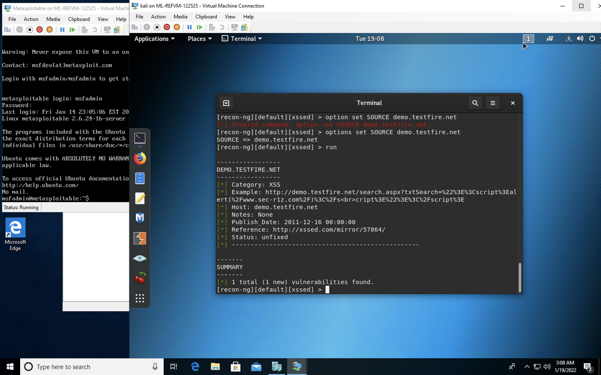

# Week 16 Homework Submission File: Penetration Testing

#### Step 1: Google Dorking

- Using Google, can you identify who the Chief Executive Officer of Altoro Mutual is:
  Karl Fitzgerald
- How can this information be helpful to an attacker:Once a high level victim is revealed the attacker can continue to recon and find out all sorts of information on the target and his company.

#### Step 2: DNS and Domain Discovery

-Enter the IP address for `demo.testfire.net` into Domain Dossier and answer the following questions   based on the results:

  1. Where is the company located: 9725 Datapoint Drive, Suite 100 San Antonio, TX

  2. What is the NetRange IP address: 65.61.137.64-65.61.137.127

  3. What is the company they use to store their infrastructure: CSC Corporate Domains Inc.

  4. What is the IP address of the DNS server: 65.61.137.117

#### Step 3: Shodan

- Port 80: http: Apache Tomcat/Coyote JSP engine
- Port 443: https: Same as above

#### Step 4: Recon-ng

- Install the Recon module `xssed`. 
- Set the source to `demo.testfire.net`. 
- Run the module. 

Is Altoro Mutual vulnerable to XSS: 
 Yes, there is an unpatched vulnerability.

### Step 5: Zenmap

Your client has asked that you help identify any vulnerabilities with their file-sharing server. Using the Metasploitable machine to act as your client's server, complete the following:

- Command for Zenmap to run a service scan against the Metasploitable machine: 
 
- Scan command as well as the output text scan
  nmap -sV 192.168.0.10 -oN zenmapscan.txt

- Zenmap vulnerability script command: nmap -sC --script smb-enum-shares 192.168.0.10

- Once you have identified this vulnerability, answer the following questions for your client:
  1. What is the vulnerability: The /tmp is available for any user to read/write.

  2. Why is it dangerous: The /tmp file is for temporary folders to execute then delete an attacker can easily insert a payload in and then execute and cover his/her tracks as the system deletes it after use. They can also lock the files to avoid access and pretty much     insert anything into them.

  3. What mitigation strategies can you recommendations for the client to protect their server: Limit user access. Modify the permissions of Users. Change the permissions to only allow the Administator access to read/write privileges.

---
© 2020 Trilogy Education Services, a 2U, Inc. brand. All Rights Reserved.  

